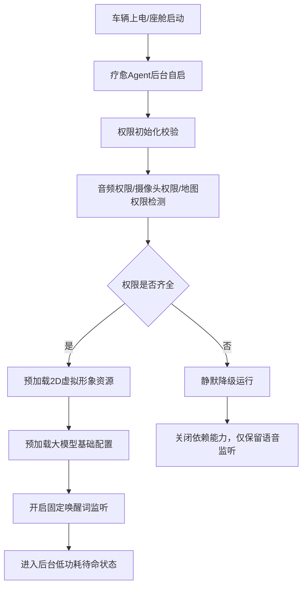

# 1_登陆初始化 & 座舱启动模块.md

阅读状态: 未读

# 1_登陆初始化&座舱启动模块 (智能座舱疗愈Agent v1.0 Demo)

**模块版本**：v1.0 Demo
**文档状态**：正式PRD
**更新日期**：2026-05-11

## 一、模块概述

座舱启动&初始化模块是疗愈Agent的底层入口能力，负责车辆上电后自动后台启动、服务初始化、音频监听拉起、资源预加载、权限校验，实现**静默后台待命**，不占用座舱前台视觉资源，为后续语音唤醒、情绪识别、虚拟形象渲染提供基础支撑。
本模块仅前装座舱部署，独立运行，无需账号登录，无用户注册流程，整车上电即自启动。

## 二、启动流程规则

| 需求点 | 原型描述（元素与交互） | 详细规则 | 异常处理 |
| --- | --- | --- | --- |
| 自启动触发 | 车辆上电、座舱系统启动后自动拉起疗愈 Agent | 无需手动点击、无需登录，完全后台静默自启 | 系统资源不足：延迟启动，不阻塞座舱主流程 |
| 无账号体系 | 不做手机号 / 第三方登录，无注册登录流程 | 面向整车司机通用，不区分账号，本地独一份画像 | 无账号异常、无登录过期逻辑 |
| 权限校验 | 启动时自动校验麦克风、摄像头、地图权限 | 缺一不可则自动降级能力 | 权限被永久禁用：静默关闭对应依赖能力 |
| 资源预加载 | 后台预加载默认 2D 虚拟形象、疗愈音色、基础话术 | 上车首次加载，后续复用缓存，减少唤醒等待 | 资源加载失败：仅保留语音交互，不展示形象 |
| 唤醒监听常驻 | 初始化完成后常驻后台监听固定唤醒词 | 低功耗运行，不占用前台 UI、不弹窗 | 后台被系统查杀：车辆行驶中自动重启监听 |
| 整车生命周期 | 座舱休眠 / 下电时自动暂停监听、释放资源 | 下电自动销毁进程，上车重新自启 | 异常休眠：恢复后自动重新进入待命 |

## 三、权限管理规则

| 需求点 | 权限类型 | 使用场景 | 降级策略 |
| --- | --- | --- | --- |
| 麦克风权限 | 语音唤醒、情绪语音采集、连续对话 | 无权限则无法语音唤醒 | 完全关闭疗愈交互能力 |
| 摄像头权限 | 面部表情情绪识别 | 无权限则自动剔除面部维度，仅用语音 + 驾驶行为识别 | 不影响基础疗愈 |
| 地图权限 | 临时停车点推荐 | 无权限关闭停车推荐能力 | 其余疗愈能力正常可用 |

## 四、降级运行策略

1. 缺失麦克风：直接关闭所有疗愈交互，静默后台待命
2. 缺失摄像头：情绪识别自动降级为「语音 + 驾驶行为」双维度
3. 缺失地图：关闭停车点推荐，其他能力不变
4. 资源加载失败：有语音无虚拟形象，不影响对话疗愈

## 五、异常处理（全局汇总）

- 座舱启动资源不足：延迟初始化，不阻塞整车核心功能
- 权限被拒绝：静默降级，无弹窗无 Toast
- 虚拟形象资源加载失败：仅保留语音交互
- 后台进程被查杀：行驶中自动重启监听服务
- 座舱休眠异常：唤醒后自动恢复待命状态
- 大模型配置拉取失败：使用本地兜底话术库