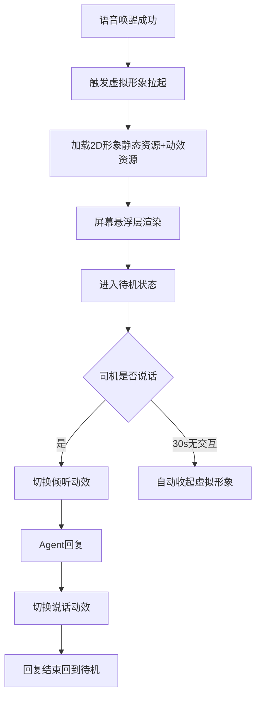
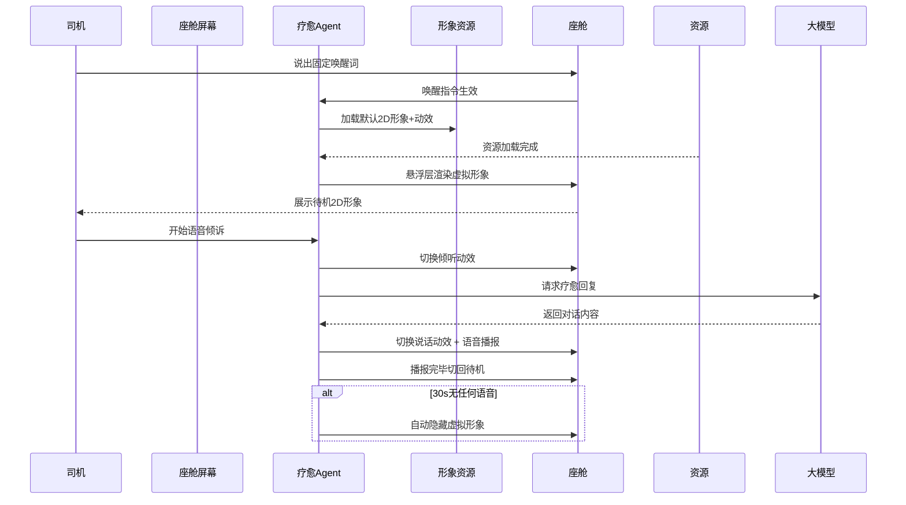

# 2_疗愈 Agent 首页 & 虚拟形象模块 (智能座舱疗愈 Agent v1.0 Demo

阅读状态: 未读

# 2_疗愈Agent首页&虚拟形象模块 (智能座舱疗愈Agent v1.0 Demo)

**模块版本**：v1.0 Demo
**文档状态**：正式PRD
**更新日期**：2026-05-11

## 一、模块概述

疗愈Agent首页&虚拟形象模块是用户唤醒后的核心视觉展示层，承载2D虚拟形象渲染、待机/倾听/说话动效、界面层级适配、座舱屏幕兼容、无交互极简设计等能力。
Demo版本仅**固定1套默认治愈系2D虚拟形象**，不支持形象切换、不支持皮肤定制；全程无按钮、无触控操作，纯语音交互，只做视觉氛围展示，不干扰导航、车速等行车核心信息。

## 二、页面整体结构

| 需求点 | 原型描述（元素与交互） | 详细规则 | 异常处理 |
| --- | --- | --- | --- |
| 页面层级 | 全局悬浮弹窗层，覆盖座舱应用之上 不遮挡导航、仪表盘、车速核心区域 | 虚拟形象固定居中偏下位置 层级高于普通应用、低于行车安全弹窗 适配中控屏所有常规分辨率 | 屏幕分辨率异常：自动等比缩放居中展示 |
| 界面元素 | 仅展示2D虚拟形象，无任何文字、按钮、图标 | Demo版极简设计，无菜单、无设置、无关闭按钮 全程无触控交互，只做视觉展示 | 元素渲染异常：只保留语音，隐藏形象 |
| 背景样式 | 虚拟形象自带透明底 无额外蒙版、无背景色块 | 融入座舱原有桌面壁纸，不破坏座舱视觉风格 | 背景渲染错乱：自动加轻微透明蒙版兜底 |
| 唤起方式 | 仅语音唤醒唤起，无桌面图标点击入口 | 不在座舱桌面生成应用图标 只能通过固定唤醒词拉起 | 唤起失败：无弹窗提示，仅静默不响应 |
| 收起方式 | 1.语音指令退出 2.30s无交互自动收起 | 无手动点击关闭入口 收起后销毁悬浮层，释放屏幕资源 | 收起逻辑异常：超时强制隐藏悬浮层 |

## 三、2D虚拟形象规则

### 3.1 形象基础设定

| 需求点 | 原型描述（元素与交互） | 详细规则 | 异常处理 |
| --- | --- | --- | --- |
| 形象数量 | Demo仅1套默认治愈系2D形象 | 不支持形象切换、不支持更换、无形象商店 | 资源缺失：展示默认占位简约形象 |
| 形象风格 | 温柔治愈风，适配车载座舱氛围 | 偏简约轻奢，不夸张、不二次元浓风格 适配全年龄段司机审美 | 风格加载异常：使用备用极简形象 |
| 尺寸规范 | 固定宽高比例，适配主流中控屏 | 不随屏幕拉伸变形，保持等比缩放 | 适配失败：按最小安全尺寸展示 |
| 形象人设 | 疗愈陪伴型人设，气质温柔沉稳 | 匹配疗愈语音音色风格 形象气质与话术风格统一 | 无异常 |

### 3.2 动效状态定义

| 需求点 | 动效类型 | 详细规则 | 异常处理 |
| --- | --- | --- | --- |
| 待机动效 | 轻微呼吸浮动效果 | 静止状态缓慢上下浮动 低帧率低功耗，不占用过多性能 | 动效播放失败：定格静态形象 |
| 倾听动效 | 轻微点头/侧耳动画 | 司机说话时触发倾听姿态 表达正在认真聆听状态 | 动效卡顿：降级为静态 |
| 说话动效 | 嘴部同步微动+轻微肢体动作 | 跟随语音播报节奏做轻微嘴部动画 不做大幅度动作，避免干扰驾驶 | 资源异常：仅静态不影响语音 |

### 3.3 形象生命周期

| 需求点 | 详细规则 | 异常处理 |
| --- | --- | --- |
| 拉起时机 | 唤醒词识别成功后立即渲染形象 | 与首次语音响应同步，整体≤2s |
| 展示期间 | 全程悬浮常驻，不主动消失 | 不因切换座舱页面、打开音乐而消失 |
| 收起销毁 | 收起后直接销毁渲染资源 不后台驻留UI | 释放图形资源，降低座舱功耗 |

## 四、交互规则（纯语音无触控）

| 需求点 | 原型描述（元素与交互） | 详细规则 | 异常处理 |
| --- | --- | --- | --- |
| 无触控操作 | 虚拟形象不可点击、不可拖拽 | 禁止任何手势交互 避免驾驶中误触分心 | 误触拦截：点击无任何响应 |
| 仅语音控制 | 所有操作依赖语音指令：退出、播放音乐、放松引导等 | 不提供任何界面按钮入口 | 指令识别失败：无响应 |
| 连续对话态 | 形象保持待机/倾听动效循环 | 连续对话期间不自动收起 | 对话中断：30s计时重新开始 |
| 超时自动收起 | 无任何语音交互满30s自动隐藏 | 计时从最后一句语音结束开始计算 | 计时异常：强制30s收起 |

## 五、座舱适配规则

| 需求点 | 详细规则 | 异常处理 |
| --- | --- | --- |
| 屏幕适配 | 适配主流车载中控屏横竖屏 | 自动识别屏幕方向，居中等比展示 |
| 层级优先级 | 低于行车安全弹窗、高于普通应用 | 不遮挡限速、导航车道、警示信息 |
| 性能功耗 | 2D动效低功耗设计 不占用GPU过高资源 | 保证行车过程流畅不卡顿 |
| 多应用共存 | 可与导航、音乐、蓝牙通话同时存在 | 不抢占音频与屏幕核心资源 |

## 六、全局异常处理（全局汇总）

- 虚拟形象资源加载失败：静默隐藏形象，仅保留语音交互正常使用
- 动效播放卡顿/异常：自动切换为静态形象，不影响疗愈功能
- 屏幕分辨率/异形屏适配异常：自动等比缩放、避让挖孔区域
- 系统弹窗覆盖形象：自动后置图层，不遮挡重要行车信息
- 30s超时计时异常：强制收起悬浮层，释放资源
- 座舱性能不足：关闭动效、保留静态形象+语音
- 唤醒成功但形象拉起失败：不弹窗，语音正常回应
- 音频通道冲突时：形象仍展示，语音暂停让路