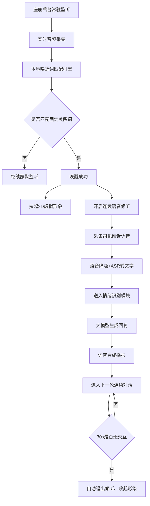
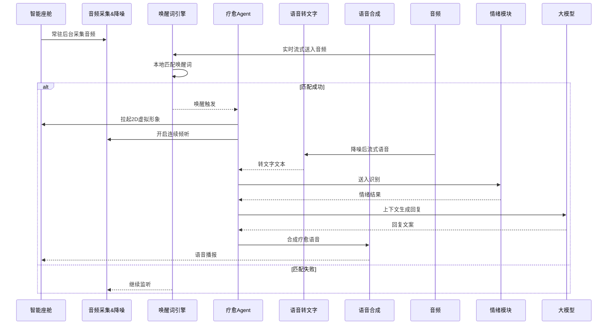

# 3_语音唤醒&语音交互模块 (智能座舱疗愈Agent v1.0 Demo)

阅读状态: 未读

# 3_语音唤醒&语音交互模块 (智能座舱疗愈Agent v1.0 Demo)

**模块版本**：v1.0 Demo
**文档状态**：正式PRD
**更新日期**：2026-05-11

## 一、模块概述

语音唤醒&语音交互模块是疗愈Agent的入口与核心交互载体，负责**固定唤醒词监听、语音采集、降噪识别、连续对话、语音播报、座舱音频适配**。
全程遵循**零触控、纯语音交互**规则，无需手动点击；唤醒+首次回应整体耗时≤2秒，Demo版不支持自定义唤醒词、不支持方言，仅标准普通话交互。

## 二、唤醒能力规则

| 需求点 | 原型描述（元素与交互） | 详细规则 | 异常处理 |
| --- | --- | --- | --- |
| 唤醒词设定 | Demo版**固定唯一唤醒词**，不支持自定义、不支持多口令 | 产品固化唤醒词，用户无法修改、无法新增 | 不提供设置入口 |
| 监听状态 | 车辆全场景后台静默监听：行驶/怠速/驻车 | 全程低功耗，不弹窗、不占用屏幕 | 系统资源不足时自动降采样监听 |
| 唤醒触发时机 | 任意时刻说出唤醒词即可触发 | 不限制车速、不限制导航/音乐播放中 | 音频通道被通话占用时拦截唤醒 |
| 唤醒响应时效 | 唤醒识别+首次回应整体≤2秒 | 从说完唤醒词到Agent语音回复完成控制在2s内 | 超时降级：仍正常语音回应，不弹窗提示 |
| 唤醒触发表现 | 唤醒成功立刻弹出2D形象 + 温柔问候语音 | 无额外弹窗、无震动、无提示音 | 形象拉起失败仍保留语音问候 |

## 三、音频采集与降噪

| 需求点 | 原型描述（元素与交互） | 详细规则 | 异常处理 |
| --- | --- | --- | --- |
| 采集方式 | 车载麦克风实时流式采集 | 适配座舱远场拾音 | 麦克风异常：直接无法唤醒 |
| 降噪能力 | 自动抑制路噪、风噪、空调噪音 | 算法降噪，提升人声识别准确率 | 噪音过大：ASR识别模糊，提示“没听清，请再说一遍” |
| 回声消除 | 开启座舱回声消除 | 避免播报语音被二次采集造成环路 | 回声消除失效：自动降级识别 |
| 音频优先级 | 导航/蓝牙通话 > 疗愈语音 > 车载音乐 | 遇到高优先级音频自动暂停倾听 | 被抢占后自动暂停，通道释放恢复监听 |

## 四、ASR语音转文字

| 需求点 | 原型描述 | 详细规则 | 异常处理 |
| --- | --- | --- | --- |
| 语言类型 | Demo仅支持**标准普通话** | 不支持方言、英语、小语种 | 非普通话无法识别，不做翻译 |
| 转文字时机 | 司机语音结束后实时转写 | 流式实时识别，无明显等待感 | 识别失败：通用兜底回复 |
| 语义理解 | 输出文本送入大模型+情绪识别 | 不单独做指令硬编码，全部由大模型理解 | 语义模糊：按闲聊温柔话术回应 |

## 五、连续对话规则

| 需求点 | 原型描述（元素与交互） | 详细规则 | 唤醒词 |
| --- | --- | --- | --- |
| 免唤醒连续对话 | 唤醒后30秒内无需重复喊唤醒词 | 自然接续聊天，随时说话都能响应 | 中途被导航打断：计时不清零 |
| 上下文记忆 | 保留本轮情绪+对话上下文 | 理解前后语义，不孤立单句 | 上下文丢失：重新开启新对话 |
| 自动退出计时 | 最后一句语音结束开始计时，30s无交互自动退出 | 退出倾听、收起虚拟形象、回到后台监听 | 计时异常：强制30s退出 |
| 手动退出指令 | 支持语音口令「退出疗愈」「关闭助手」 | 识别任意同类退出话术均可 | 指令识别失败，等待超时自动关闭 |

## 六、TTS语音合成&音色

| 需求点 | 原型描述 | 详细规则 | 异常处理 |
| --- | --- | --- | --- |
| 音色设定 | Demo固定**温柔治愈女声** | 不可切换、不可调节音色风格 | TTS加载失败：文字逻辑正常，无语音播报 |
| 语速语调 | 平缓低沉、治愈语速，适配驾驶场景 | 不急促、不高亢，情绪安抚向 | 语速异常：使用默认标准语速 |
| 音量自适应 | 自动根据座舱环境调节播报音量 | 导航播报时自动降低疗愈语音 | 音量调节失效：使用固定中等音量 |
| 播报打断 | 司机说话时可打断Agent当前播报 | 支持边说边打断，自然对话体验 | 无法打断：播报完成再进入倾听 |

## 七、语音指令能力（Demo版支持）

### 支持语音指令

1. 退出疗愈
2. 播放舒缓音乐
3. 停止音乐
4. 带我找附近停车点
5. 帮我做深呼吸放松
6. 我很生气/我很烦/我很累（情绪倾诉）

所有指令**仅语音触发，无界面按钮**。

## 八、全局异常处理（全局汇总）

- 唤醒词识别失败：静默无响应，不弹窗不提示
- 麦克风权限缺失：直接关闭监听，无法唤醒
- 蓝牙/通话占用音频：拦截唤醒，保持静默
- 环境噪音过大：语音提示「没听清，请再说一遍」
- ASR识别失败：触发通用温柔兜底安抚话术
- TTS语音合成失败：仅形象动效，无语音播报
- 响应超时大于2s：不弹窗，正常完成对话
- 连续对话中断：重新喊唤醒词即可恢复
- 音频通道抢占：自动暂停倾听，通道恢复继续使用

---

[https://www.notion.so](https://www.notion.so)

[https://www.notion.so](https://www.notion.so)

[https://www.notion.so](https://www.notion.so)