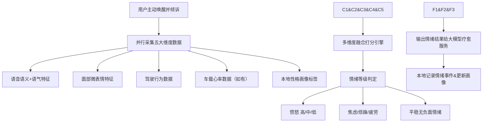
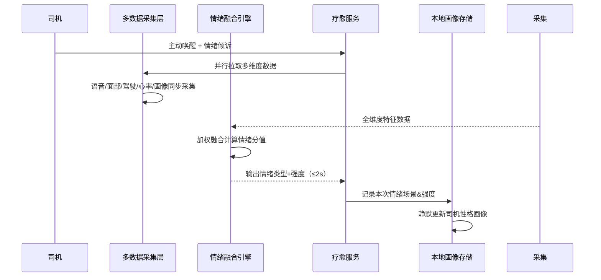

# 4_多维度情绪识别模块 (智能座舱疗愈Agent v1.0 Demo)

阅读状态: 未读

# 4_多维度情绪识别模块 (智能座舱疗愈Agent v1.0 Demo)

**模块版本**：v1.0 Demo
**文档状态**：正式PRD
**更新日期**：2026-05-11

## 一、模块概述

多维度情绪识别模块是疗愈Agent的核心算法能力，**仅在用户主动唤醒后触发**，融合五大维度数据进行综合情绪判定：
语音语义&语气、司机面部表情、实时驾驶行为、本机心率采集（如有）、历史性格画像。
核心主打**愤怒情绪识别**，兼顾焦虑/烦躁/疲劳三类负面情绪；识别+首次整体响应耗时严格≤2s。
Demo版暂不做人工纠错、不做被动自动监测、不支持复杂情绪细分。

## 二、数据采集维度明细

| 维度 | 采集内容 | 识别作用 | 缺失降级规则 |
| --- | --- | --- | --- |
| 语音维度 | 倾诉文本语义、说话语速、语调高低、音量起伏、情绪化关键词 | 判断主观愤怒/焦虑/烦躁倾向 | 无麦克风直接不可用 |
| 面部表情 | 眉头紧锁、嘴角下沉、面部紧绷、烦躁微表情 | 辅助校验情绪真实强度 | 无摄像头自动舍弃该维度 |
| 驾驶行为 | 当前车速、急刹频次、频繁变道、急转弯、拥堵跟车行为 | 判断驾驶压力、路怒诱因 | 无行车数据仍可正常识别 |
| 心率监测 | 实时心率高低、心率波动幅度 | 辅助判定情绪激动程度 | 无硬件心率则自动忽略该维度 |
| 性格画像 | 历史易怒频次、内向/外向、感性/理性标签 | 适配个性化疗愈风格 | 画像缺失使用通用基准模型 |

## 三、情绪分类与判定规则

### 3.1 情绪类型覆盖

- 核心优先级：**愤怒（主）**
- 次要覆盖：焦虑、烦躁、疲劳
- 兜底：平稳无负面情绪

### 3.2 分值判定逻辑

| 情绪类型 | 识别特征规则 | 输出结果 |
| --- | --- | --- |
| 愤怒 | 语音暴躁+语速快+负面关键词+面部紧绷+频繁急刹变道 | 高中低三档强度 |
| 焦虑 | 语速急促、内心不安类话术、轻微面部焦虑 | 统一归为轻度焦虑 |
| 烦躁 | 语气不耐烦、抱怨路况、小幅情绪波动 | 轻度烦躁标签 |
| 疲劳 | 语速低沉、慵懒、哈欠类语音特征、驾驶状态松弛 | 身心疲劳标签 |
| 平稳 | 无负面语义、表情放松、驾驶平稳 | 无负面情绪 |

### 3.3 响应时效要求

| 需求点 | 详细规则 | 异常处理 |
| --- | --- | --- |
| 整体耗时 | 从用户结束倾诉 → 输出情绪结果 ≤2秒 | 超时后仍正常输出结果，不弹窗提示 |
| 并行计算 | 所有维度并行采集、同时计算，不串行等待 | 某一维度延迟不阻塞整体结果 |
| 结果输出 | 直接输出情绪类型+情绪强度给到疗愈大模型 | 不向用户展示情绪分数，后台静默使用 |

## 四、触发与使用规则

| 需求点 | 原型描述 | 详细规则 | 异常处理 |
| --- | --- | --- | --- |
| 触发方式 | **仅主动唤醒后触发** | 不做后台被动情绪监测、不自动弹窗介入 | 行驶中静默监听，不打扰用户 |
| 识别时机 | 首次倾诉做一次完整情绪识别 | 后续对话不再重新识别，依赖大模型上下文理解情绪变化 | 中途情绪变化不二次判定 |
| 场景标签 | 自动标记：拥堵/高速/市区/怠速/夜间 | 用于本地画像统计与后续策略优化 | 场景识别失败标记为通用场景 |
| 多维度加权 | 语音+驾驶行为为核心权重，面部/心率为辅助权重 | 保证无硬件情况下识别可用性 | 维度缺失自动重新加权计算 |

## 五、降级策略

| 缺失硬件/数据 | 降级处理逻辑 |
| --- | 无摄像头 | 仅保留语音+驾驶行为+画像三维识别 |
| 无心率硬件 | 舍弃心率维度，不影响主识别 |
| 行车数据异常 | 仅靠语音+面部+画像识别 |
| 初次使用无画像 | 采用通用情绪基准模型判定 |

## 六、本地数据沉淀规则

| 需求点 | 详细规则 | 异常处理 |
| --- | --- | --- |
| 记录内容 | 情绪类型、情绪强度、触发场景、时间、对话摘要 | 仅本地存储，不上云 |
| 更新时机 | 每次疗愈交互结束后静默更新画像 | 不占用交互实时性能 |
| 画像迭代 | 累计多次情绪数据后，自动更新易怒、性格标签 | 数据异常保留旧画像，不强行变更 |
| 数据用途 | 仅用于本地疗愈话术风格适配、策略优化 | 不做数据分析、不上报第三方 |

## 七、全局异常处理

- 麦克风异常：直接无法进入情绪识别流程
- 摄像头故障：自动剔除面部维度，其余正常识别
- 行车数据接口异常：降级为语音+表情识别
- 识别超时>2s：仍正常输出结果，无弹窗提示
- 情绪特征模糊：默认降级为轻度焦虑
- 初次无用户画像：使用通用模型兜底识别
- 多维度数据部分缺失：自动重新加权计算，不阻塞流程

---

[https://www.notion.so](https://www.notion.so)

[https://www.notion.so](https://www.notion.so)

[https://www.notion.so](https://www.notion.so)