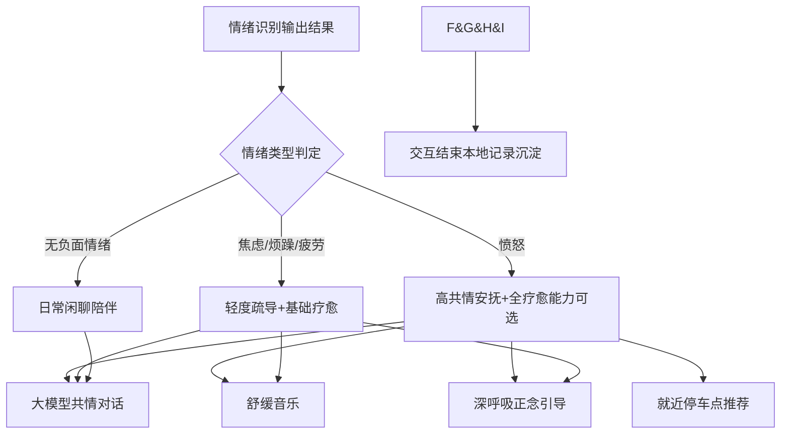
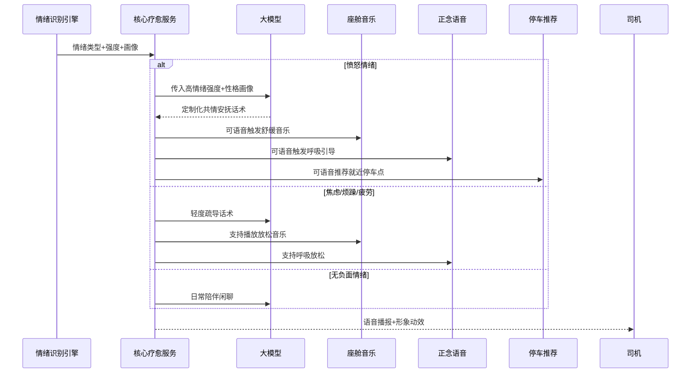

# 5_核心疗愈服务模块 (智能座舱疗愈Agent v1.0 Demo)

阅读状态: 未读

# 5_核心疗愈服务模块 (智能座舱疗愈Agent v1.0 Demo)

**模块版本**：v1.0 Demo
**文档状态**：正式PRD
**更新日期**：2026-05-11

## 一、模块概述

核心疗愈服务模块是整个Agent的业务能力中枢，基于**情绪识别结果 + 司机性格画像**，提供多维度疗愈能力：
大模型共情对话、舒缓音乐播放、深呼吸正念引导、就近停车点推荐。
全程纯语音触发、纯语音交互，适配驾驶场景不分心；Demo版不支持自定义疗愈库、不联动灯光香氛，只做基础四大疗愈能力闭环。

## 二、疗愈能力总览

Demo版包含4项核心疗愈能力：

1. 大模型共情对话安抚（核心必选）
2. 舒缓音乐播放/暂停
3. 深呼吸正念语音引导
4. 就近临时停车点智能推荐

所有能力**仅语音指令触发**，无界面按钮、无手动操作。

## 三、3.1 大模型共情对话安抚

| 需求点 | 原型描述 | 详细规则 | 异常处理 |
| --- | --- | --- | --- |
| 话术匹配逻辑 | 根据情绪类型+强度+司机性格生成专属安抚对话 | 愤怒：共情理解、理性疏导、温和劝解 焦虑/烦躁：解压放松、情绪舒缓 疲劳：温柔关怀、缓解疲惫 无情绪：轻松日常闲聊 | 大模型响应超时：触发本地预设兜底安抚话术 |
| 对话风格 | 匹配治愈温柔女声人设，语气平缓克制 | 不亢奋、不说教、不情绪化 贴合车载驾驶场景，简短易懂 | 话术内容不适配：自动降级通用模板 |
| 上下文记忆 | 保留单次疗愈全程对话上下文 | 理解连续倾诉、重复情绪表达 | 上下文丢失：新开对话不影响使用 |
| 响应时效 | 对话回复跟随整体≤2s时效标准 | 保证驾驶流畅感 | 超时不弹窗，静默完成回复 |
| 个性化适配 | 结合本地性格画像调整话术风格 | 内向：温柔安静疏导 外向：轻松陪伴聊天 易怒：更耐心共情 | 画像缺失：使用通用标准话术 |

## 三、3.2 舒缓音乐服务

| 需求点 | 原型描述（元素与交互） | 详细规则 | 异常处理 |
| --- | --- | --- | --- |
| 触发指令 | 语音口令：「放舒缓音乐」「停止音乐」 | 仅语音触发，无界面播放按钮 | 指令识别失败：无响应 |
| 音乐库 | Demo内置固定治愈轻音乐列表 | 纯舒缓、无歌词、无强节奏，适配驾驶 | 资源缺失：语音提示「暂时无法播放音乐」 |
| 音频优先级 | 导航/通话 > 疗愈音乐 > 普通车载音乐 | 导航播报时自动降低音乐音量 | 音频通道冲突：自动暂停音乐，导航结束恢复 |
| 播放逻辑 | 顺序循环播放，语音可随时停止 | 不支持切歌、不支持收藏（Demo简化） | 播放失败自动换下一首 |
| 音量适配 | 自动适配座舱基础音量 | 不突兀、不刺耳，保持背景舒缓氛围 | 音量调节异常：固定中等音量兜底 |

## 三、3.3 深呼吸正念引导

| 需求点 | 原型描述 | 详细规则 | 异常处理 |
| --- | --- | --- | --- |
| 触发指令 | 语音口令：「帮我做放松引导」「停止引导」 | 全程语音带领，无需看屏幕 | 指令识别失败：无响应 |
| 引导流程 | 标准正念呼吸节奏：吸气4s→屏息4s→呼气6s | 语速平缓、节奏清晰，适配驾驶时跟随 | 引导语音卡顿：重新发起即可 |
| 场景适配 | 适合路怒、烦躁、疲劳时快速平复情绪 | 步骤简单，不分心驾驶操作 | 中途可随时语音停止 |
| 终止逻辑 | 语音停止 / 30s无交互自动结束引导 | 不强制长时间引导 | 异常中断自动结束 |

## 三、3.4 临时停车点推荐

| 需求点 | 原型描述（元素与交互） | 详细规则 | 异常处理 |
| --- | --- | --- | --- |
| 触发条件 | 情绪愤怒偏高时可主动语音推荐，也可语音手动触发 | 口令：「帮我找附近停车点」 | 指令识别失败：无响应 |
| 推荐逻辑 | 调用座舱地图接口，推荐当前就近安全临时停车区域 | 优先选择服务区、路边合规停车区、园区空地等 | 无数据：语音提示「暂无附近停车推荐」 |
| 展示方式 | 仅语音播报地点名称与大致方位 | 不弹窗、不跳转导航，避免驾驶分心 | 地图接口异常：静默不推荐 |
| 安全限制 | 不引导危险停靠点，只推荐合规安全区域 | 过滤高速应急车道、禁停区域 | 数据异常不推送危险点位 |

## 四、疗愈策略匹配规则

| 情绪类型 | 默认疗愈组合策略 |
| --- | --- |
| 愤怒 | 共情对话 + 可选音乐/呼吸/停车推荐 |
| 焦虑/烦躁 | 轻度疏导 + 舒缓音乐/呼吸引导 |
| 疲劳 | 温柔关怀 + 放松音乐引导 |
| 平稳无情绪 | 日常闲聊陪伴 |

系统自动匹配，用户可自由语音切换任意疗愈服务。

## 五、会话生命周期规则

| 需求点 | 详细规则 | 异常处理 |
| --- | --- | --- |
| 单次会话时长 | 唤醒后30s无交互自动结束 | 超时自动收起形象、停止所有疗愈服务 |
| 会话中断 | 导航/通话抢占音频时暂停疗愈 | 通道释放后自动恢复对话 |
| 手动结束 | 语音「退出疗愈」立即终止所有服务 | 音乐/引导同步停止 |
| 会话结束后 | 静默记录本次情绪数据、更新用户画像 | 存储异常不影响本次体验 |

## 六、全局异常处理（汇总）

- 大模型响应超时：自动调用本地安抚兜底话术
- 音乐资源缺失/播放失败：语音友好提示
- 音频通道被导航/通话占用：自动暂停疗愈音乐与播报
- 正念引导语音卡顿：用户重新指令即可恢复
- 地图无停车数据/接口异常：不强行推荐，语音提示
- 情绪画像缺失：使用通用疗愈话术模板
- 指令识别失败：静默无响应，不弹窗打扰
- 会话超时异常：强制结束所有疗愈服务

---

[https://www.notion.so](https://www.notion.so)

[https://www.notion.so](https://www.notion.so)

[https://www.notion.so](https://www.notion.so)