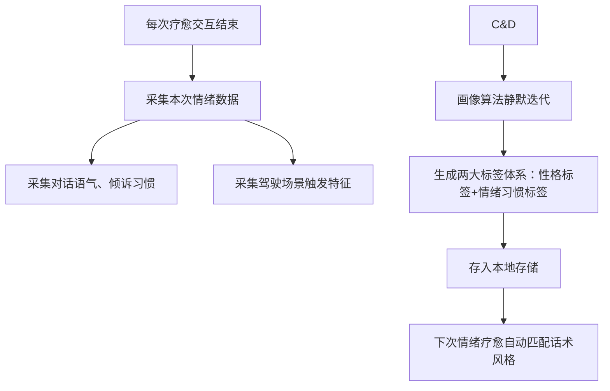
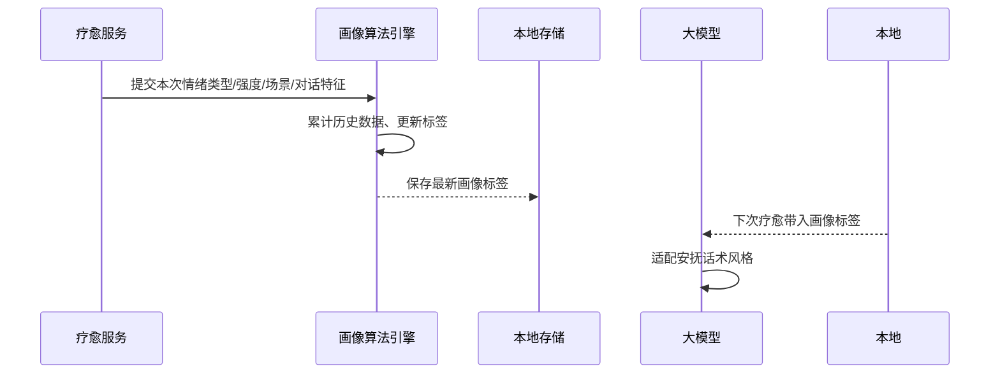

# 6_司机性格&用户画像模块 (智能座舱疗愈Agent v1.0 Demo)

阅读状态: 未读

# 6_司机性格&用户画像模块 (智能座舱疗愈Agent v1.0 Demo)

**模块版本**：v1.0 Demo
**文档状态**：正式PRD
**更新日期**：2026-05-11

## 一、模块概述

司机性格&用户画像模块，负责**基于每次疗愈交互行为、情绪数据、对话风格**，本地自动生成司机性格标签、情绪习惯标签。
全程**不上云、仅本地存储**，画像只用于适配疗愈话术风格、个性化安抚策略，无界面展示、无手动编辑入口，完全后台静默生成与迭代。

Demo版支持手动编辑画像、支持画像可视化，后台算法沉淀，为疗愈对话提供个性化适配依据。

## 二、画像标签体系

### 1. 性格标签（2组对立维度）

| 标签维度 | 可选标签值 | 画像作用 |
| --- | --- | --- |
| 外向 / 内向 | 外向、内向 | 外向：轻松闲聊式安抚 内向：安静温柔共情式疏导 |
| 感性 / 理性 | 感性、理性 | 感性：偏情感共鸣安抚 理性：偏逻辑劝解、冷静疏导 |

### 2. 情绪习惯标签

| 标签 | 含义 | 疗愈适配作用 |
| --- | --- | --- |
| 易激怒 | 频繁产生愤怒情绪 | 话术更耐心、共情度更高 |
| 易焦虑 | 常出现烦躁焦虑 | 偏向放松、解压类话术 |
| 易疲劳 | 长途/夜间易疲惫 | 偏向温柔关怀、舒缓语气 |
| 路况敏感 | 拥堵易情绪化 | 针对性路况安抚话术 |

## 三、画像生成规则

| 需求点 | 原型描述 | 详细规则 | 异常处理 |
| --- | --- | --- | --- |
| 生成方式 | 完全后台静默算法生成，有用户手动设置入口 | 用户可主动填写资料，也可基于真实交互行为沉淀 | 数据不足时默认通用基准画像 |
| 数据来源 | 每次疗愈后自动采集： 1.情绪类型与强度 2.倾诉语气用词 3.触发场景（拥堵/高速/夜间等） 4.交互偏好（爱闲聊/沉默倾听） | 不采集隐私信息，只做行为特征统计 | 单条数据异常自动过滤，不影响画像 |
| 迭代时机 | 每次疗愈会话结束后静默更新 | 不占用实时交互性能，后台低功耗计算 | 迭代失败保留原有画像，不强行变更 |
| 生效时机 | 画像更新后，下一次疗愈立即生效 | 无需重启座舱，实时适配话术风格 | 画像读取失败自动降级为通用风格 |
| 初始默认画像 | 新用户无历史数据时，默认：内向+理性 基准模板 | 保证首次疗愈体验统一 | 无初始数据不影响使用 |

## 四、画像应用场景

| 应用场景 | 画像使用规则 |
| --- | --- |
| 大模型疗愈话术 | 根据性格标签匹配语气、共情程度、表达方式 |
| 情绪策略适配 | 易激怒用户优先深度共情；易疲劳优先温柔安抚 |
| 场景化疏导 | 路况敏感用户针对拥堵场景定制安抚话术 |
| 连续对话风格 | 匹配用户说话节奏，贴合司机交流习惯 |

## 五、画像生命周期

1. **初始化**：新用户无数据，加载默认基准画像
2. **累计沉淀**：每一次疗愈行为作为样本累计
3. **标签迭代** ：样本达到阈值后自动切换性格/情绪标签
4. **长期稳定**：形成稳定性格后小幅微调，不频繁大变风格
5. **数据清空**：支持语音指令一键清空所有画像&情绪记录，恢复默认模板

## 六、权限与隐私规则

| 需求点 | 详细规则 | 异常处理 |
| --- | --- | --- |
| 存储位置 | 全部仅本地座舱存储，不上云、不上报 | 无云端同步、无第三方数据分析 |
| 数据范围 | 仅性格标签、情绪习惯、场景统计 不存储语音原文、面部隐私等敏感数据 | 严格最小化采集 |
| 手动清空 | 语音指令「清除我的情绪记录」可重置画像 | 清空后立即恢复默认基准画像 |
| 数据隔离 | 单座舱独立画像，不区分多用户 | Demo不支持多账号多画像 |

## 七、全局异常处理

- 画像算法计算异常：保留上一次稳定画像
- 本地存储读取失败：自动使用通用默认画像
- 单次交互数据异常：自动过滤不纳入画像计算
- 清空记录失败：静默重试，无弹窗提示
- 新用户数据不足：始终使用基准模板，不强行生成标签

---

[https://www.notion.so](https://www.notion.so)

[https://www.notion.so](https://www.notion.so)

[https://www.notion.so](https://www.notion.so)