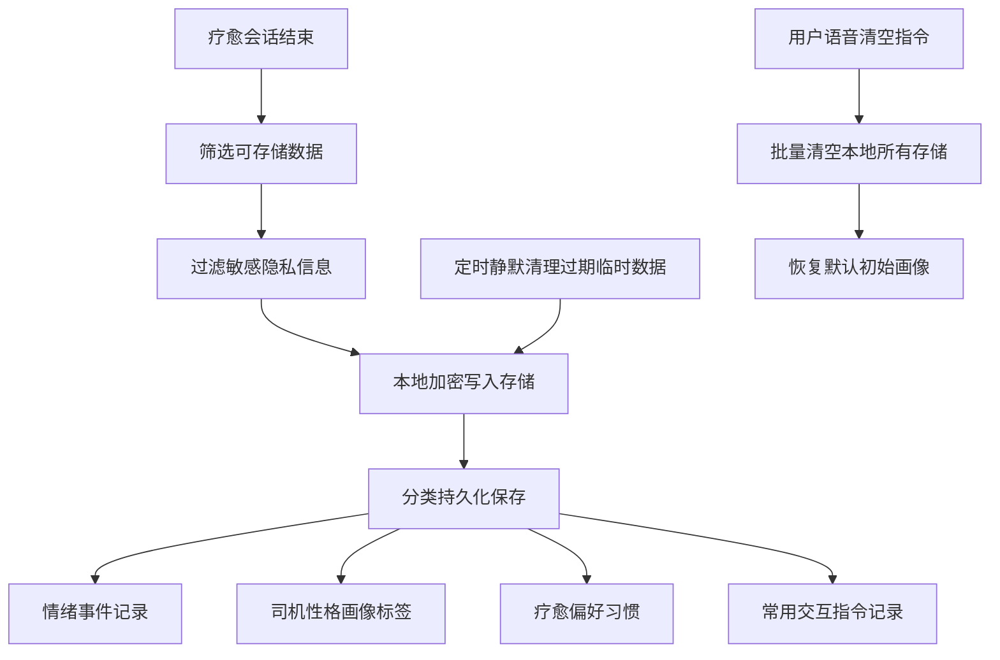
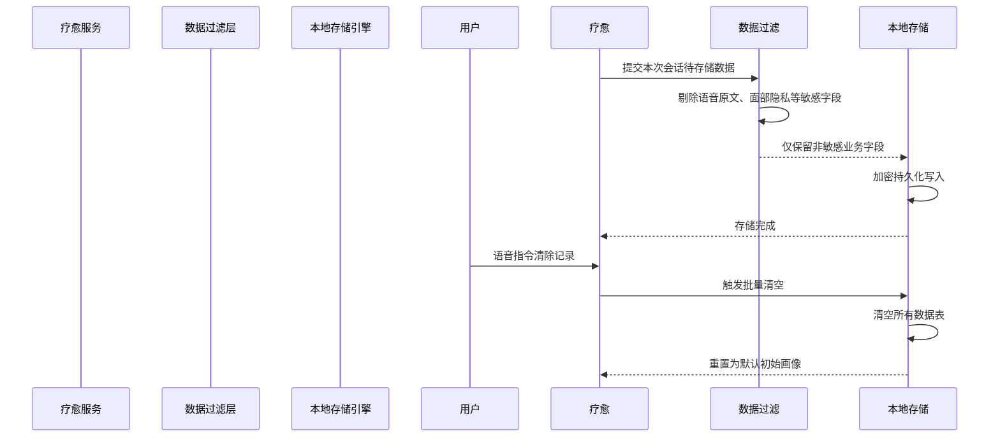

# 7_本地数据存储&隐私模块 (智能座舱疗愈Agent v1.0 Demo)

阅读状态: 未读

# 7_本地数据存储&隐私模块 (智能座舱疗愈Agent v1.0 Demo)

**模块版本**：v1.0 Demo
**文档状态**：正式PRD
**更新日期**：2026-05-11

## 一、模块概述

本地数据存储&隐私模块负责**疗愈全链路数据本地持久化、隐私合规管控、数据生命周期管理**。
核心规则：**所有情绪数据、对话记录、性格画像全部仅本地存储，不上云、不上报、不对外共享**；Demo版无云端同步、无多端漫游、无后台数据上报，严格遵循车载隐私规范，同时提供语音一键清空数据能力。

## 二、存储总体规则

| 需求点 | 原型描述 | 详细规则 | 异常处理 |
| --- | --- | --- | --- |
| 存储介质 | 全部数据仅保存在智能座舱本地 | 不上云端、不服务器同步、不上报数据分析平台 | 无网络也可正常读写 |
| 加密规则 | 本地轻量化加密存储 | 防止本地文件明文泄露，保障车载隐私 | 加密解析失败自动使用默认空数据 |
| 数据最小化 | 只存业务标签，不存原始音视频、原始人脸图像 | 不保存麦克风原始录音、不保存面部原图 | 严格过滤敏感原始数据 |
| 生命周期 | 长期有效，用户主动清空才重置 | 无自动过期删除，保留长期情绪习惯数据 | 存储异常不丢失核心配置 |
| 多用户隔离 | Demo版不支持多账号，整车共用一份本地画像 | 不区分驾驶员/乘客独立账号 | 无多用户数据冲突逻辑 |

## 三、可存储数据范围

### 3.1 允许本地存储内容

1. 情绪事件：情绪类型（愤怒/焦虑/烦躁/疲劳）、情绪强度
2. 触发场景：拥堵/高速/市区/怠速/夜间场景标签
3. 会话统计：疗愈交互时间、会话时长
4. 司机性格标签：内向/外向、感性/理性、情绪习惯标签
5. 疗愈偏好：常用语音指令、偏好疗愈方式

### 3.2 禁止存储内容

1. 不存储麦克风原始语音、ASR完整文本原文
2. 不存储司机面部原始照片、面部原图
3. 不存储实时心率原始数值、隐私生理信息
4. 不存储行车精准地理位置、个人行车轨迹
5. 不对外共享任何本地数据给第三方应用

## 四、数据写入&更新规则

| 需求点 | 详细规则 | 异常处理 |
| --- | --- | --- |
| 写入时机 | 每次疗愈会话结束后，后台静默写入 | 不占用交互实时性能 |
| 数据过滤 | 写入前自动剔除所有敏感原始数据 | 过滤失败则本条不写入，保护隐私 |
| 画像更新 | 伴随情绪记录同步迭代性格标签 | 更新失败保留旧画像，不强行覆盖 |
| 并发写入 | 多疗愈事件串行排队写入 | 避免数据错乱 |
| 启动加载 | 座舱上电自动读取本地画像与历史记录 | 读取失败加载默认初始配置 |

## 五、数据清空能力

| 需求点 | 原型描述 | 详细规则 | 异常处理 |
| --- | --- | --- | --- |
| 触发方式 | 仅语音指令触发：「清除我的情绪记录」 | 无界面设置清空入口，全程语音操作 | 指令识别失败无任何操作 |
| 清空范围 | 清空所有情绪历史、性格画像、偏好记录 | 清空后恢复出厂默认基准画像 | 清空部分失败则整体回滚 |
| 清空效果 | 立即生效，无需重启座舱 | 下一次疗愈直接使用默认性格模板 | 清空异常保留原有数据 |
| 二次确认 | 语音指令触发后，口语二次确认「确认清除吗」 | 用户回答「确认/取消」再执行 | 超时自动取消清空操作 |

## 六、隐私合规规则

| 需求点 | 详细规则 | 异常处理 |
| --- | --- | --- |
| 不上云原则 | 全程无任何数据上传接口 | 关闭所有上报埋点，不采集隐私日志 |
| 第三方隔离 | 本地数据不向座舱其他应用共享 | 无跨应用数据读取权限 |
| 权限最小化 | 仅申请业务必需麦克风/摄像头/地图权限 | 多余隐私权限不申请、不静默采集 |
| 透明规则 | 无显性隐私协议弹窗，行为默认遵循不上云规则 | Demo简化交互，后台严格遵守隐私逻辑 |

## 七、异常处理（全局汇总）

- 本地存储写入失败：丢弃本条记录，不影响整体历史数据
- 加密解析异常：加载默认空画像，不泄露明文
- 读取数据损坏：自动重置为初始默认配置
- 并发写入冲突：串行排队，避免数据错乱
- 语音清空指令识别失败：不执行任何操作
- 清空部分数据失败：整体事务回滚，保留原数据
- 座舱恢复出厂：随系统一并清除本地疗愈数据

---

[https://www.notion.so](https://www.notion.so)

[https://www.notion.so](https://www.notion.so)

[https://www.notion.so](https://www.notion.so)