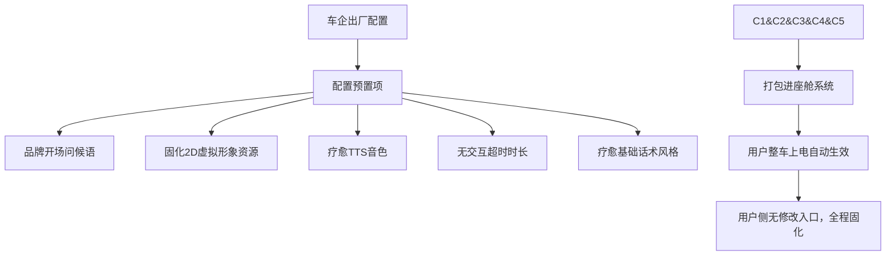
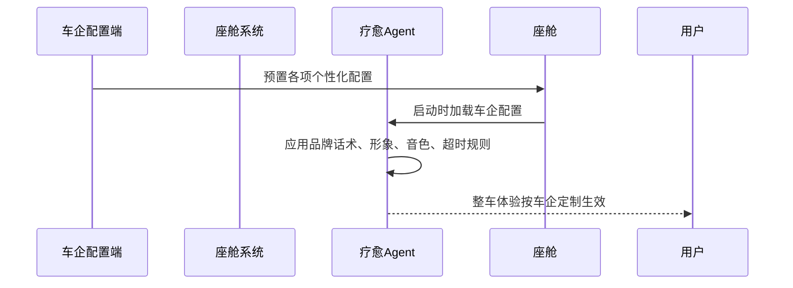

# 8_车企个性化配置模块 (智能座舱疗愈Agent v1.0 Demo)

阅读状态: 未读

# 8_车企个性化配置模块 (智能座舱疗愈Agent v1.0 Demo)

**模块版本**：v1.0 Demo
**文档状态**：正式PRD
**更新日期**：2026-05-11

## 一、模块概述

车企个性化配置模块，面向前装车企提供**可定制化基础配置能力**。
Demo版本不开放用户自定义，仅支持车企出厂前后台/配置文件预置定制；包含品牌话术、2D虚拟形象固化配置、疗愈音色、基础交互时长等定制项。
用户侧无任何配置入口，所有定制内容出厂固化，整车用户不可修改。

## 二、可定制配置项总览

| 配置项 | 定制范围 | 用户是否可修改 | Demo支持情况 |
| --- | --- | --- | --- |
| 品牌开场问候语 | 唤醒后首次问候文案，植入车企品牌调性 | 否 | 支持 |
| 2D虚拟形象 | 替换整套默认治愈系形象资源 | 否 | 支持（Demo固定1套，车企可替换资源） |
| TTS疗愈音色 | 更换温柔/沉稳等预设音色 | 否 | 支持 |
| 无交互超时时长 | 自定义15s/30s/60s自动收起 | 否 | 支持 |
| 疗愈话术风格 | 偏温柔/偏沉稳话术模板 | 否 | 支持 |
| 唤醒词 | 固化专属品牌唤醒口令 | 否 | Demo固定唤醒词，车企可预置替换 |

## 三、分项定制规则

### 3.1 品牌开场问候语

| 需求点 | 原型描述 | 详细规则 | 异常处理 |
| --- | --- | --- | --- |
| 定制位置 | 唤醒成功后的首次Agent语音问候 | 可植入车企slogan、品牌语气 |  |
| 配置方式 | 车企出厂预置文案，用户不可编辑 | 支持多语言预置（本期仅中文） |  |
| 生效逻辑 | 上电加载一次，全程固化展示 | 异常加载失败：使用默认通用问候语 |  |

### 3.2 2D虚拟形象定制

| 需求点 | 原型描述 | 详细规则 | 异常处理 |
| --- | --- | --- | --- |
| 定制范围 | 替换整套2D形象静态图+三套动效（待机/倾听/说话） | 保持原有尺寸、层级、动效逻辑不变，只替换视觉资源 |  |
| 适配规范 | 车企提供透明底2D素材，符合座舱分辨率比例 | 素材比例异常：系统自动等比居中适配 |  |
| 用户权限 | 无形象切换入口，整车唯一固化形象 | 资源加载失败：降级为简约默认占位形象 |  |

### 3.3 TTS疗愈音色定制

| 需求点 | 原型描述 | 详细规则 | 异常处理 |
| --- | --- | --- | --- |
| 定制选项 | 提供多套标准治愈系音色库供车企选择 | Demo内置多款备选，车企选定后固化 |  |
| 不可变更 | 用户侧无音色切换按钮、无设置入口 | TTS资源异常：使用兜底标准女声 |  |
| 语调风格 | 跟随车企选择适配平缓治愈风格 | 不支持自定义语速、音调微调 |  |

### 3.4 无交互超时时长定制

| 需求点 | 原型描述 | 详细规则 |
| --- | --- | --- |
| 可选档位 | 15s / 30s / 60s 三档可选 |  |
| 出厂固化 | 车企选定后整车固定超时时间 |  |
| 用户权限 | 不可手动修改超时自动收起规则 |  |

### 3.5 疗愈话术风格定制

| 需求点 | 原型描述 | 详细规则 |
| --- | --- | --- |
| 风格分类 | 温柔治愈风 / 沉稳理性风 两套模板 |  |
| 定制逻辑 | 车企选定后，大模型安抚话术固定偏向该风格 |  |
| 用户侧 | 无风格切换入口，全程固化 |  |

### 3.6 唤醒词定制

| 需求点 | 原型描述 | 详细规则 |
| --- | --- | --- |
| 定制规则 | Demo默认固定唤醒词，车企可出厂替换专属唤醒口令 |  |
| 限制 | 仅支持普通话简短唤醒词，不支持方言 |  |
| 用户权限 | 不可自定义、不可新增唤醒词 |  |

## 四、配置加载与生效逻辑

| 需求点 | 详细规则 | 异常处理 |
| --- | --- | --- |
| 加载时机 | 座舱上电、Agent初始化时一次性加载所有车企配置 | 配置拉取失败：全部降级为Demo默认配置 |
| 生效范围 | 整车所有驾驶场景统一生效 | 不分车型、不分驾驶模式变更配置 |
| 不可热更新 | 配置修改需整车刷机/升级系统生效，不支持在线热更 | 后续版本可扩展在线配置，Demo不支持 |
| 用户隔离 | 所有定制项对用户完全隐藏，无设置页面 | 避免用户误改车企品牌定制内容 |

## 五、用户侧表现规则

1. 用户**看不到任何配置入口**，无法修改形象、音色、问候语、超时时间。
2. 所有定制内容出厂固化，全程跟随整车品牌风格。
3 任何配置加载异常，自动回落至Demo默认版本，不影响核心疗愈功能。
3. 不提供后期用户个性化设置，仅保留车企前装定制能力。

## 六、全局异常处理

- 车企配置文件缺失：自动回落Demo默认全套配置
- 2D形象资源替换异常：使用默认占位形象
- TTS音色资源加载失败：兜底标准治愈女声
- 问候语配置为空：使用通用默认问候
- 超时时间配置非法：强制固定30s兜底
- 话术风格配置无效：启用温柔治愈默认风格

---

[https://www.notion.so](https://www.notion.so)

[https://www.notion.so](https://www.notion.so)

[https://www.notion.so](https://www.notion.so)