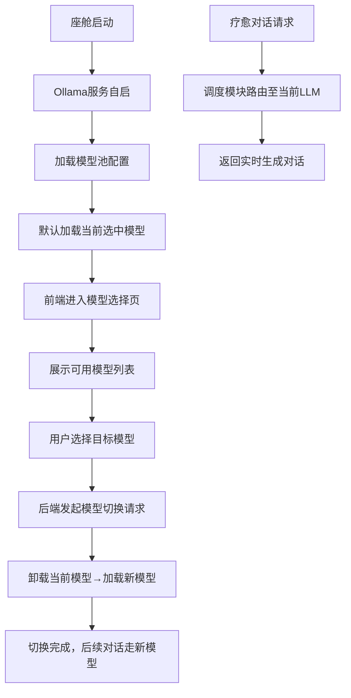
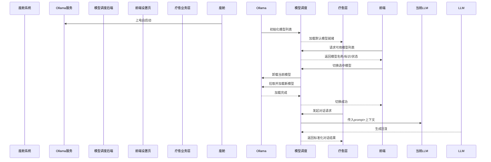
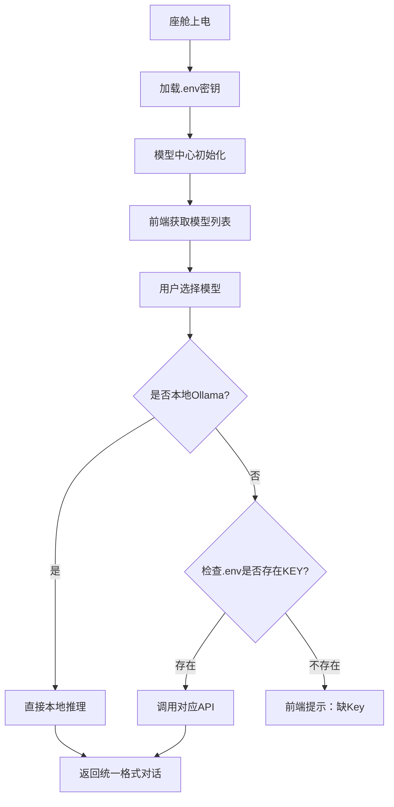
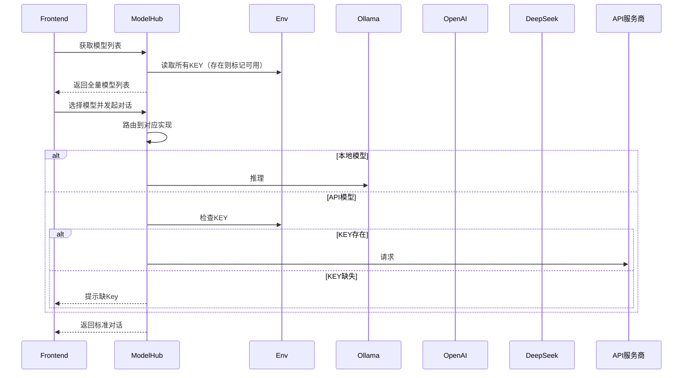

# 文档1：Agent大模型调度模块PRD

阅读状态: 未读

# Agent大模型调度模块 (智能座舱疗愈Agent v1.0 Demo)

**模块版本**：v1.0 Demo
**文档状态**：正式PRD
**更新日期**：2026-05-11

## 一、模块概述

Agent大模型调度模块为底层核心能力，**统一封装本地Ollama推理 + 市面主流大模型API**，实现一套接口、多模型无缝切换。，**不使用固定预设语音文案**，全量对话由本地LLM实时生成。
支持**多模型池管理、前端手动切换模型、后端动态热切换**，适配智能座舱离线无网络场景，支撑情绪疗愈、日常陪伴、正念引导等全对话场景，保障数据不出车、隐私本地化。

支持：

1. **Ollama本地离线模型**（无网可用、隐私优先）
2. **主流云端API模型**（OpenAI、DeepSeek、Doubao、Qwen、Moonshot、Anthropic）
3. 所有模型统一入参出参，业务层无感知
4. `.env` 统一密钥管理，密钥缺失**后台不报错**，前端使用时才提示
5. 前端模型选择器：本地模型 / API模型同列表展示
6. 动态热切换，无需重启服务

废弃所有预设话术，全部对话由统一模型层实时生成。

---

## 二、支持模型范围（完整列表）

### 2.1 本地模型（Ollama）

- 无需API Key
- 离线运行
- 座舱本地推理

### 2.2 云端API模型（需Key）

- OpenAI GPT-3.5 / GPT-4o
- DeepSeek 深度求索
- Doubao 火山方舟豆包
- Qwen 通义千问
- Moonshot Kimi
- Anthropic Claude

## 三、核心能力

1. 基于Ollama实现**本地私有化大模型部署**，无需联网、离线可用
2. 内置多LLM模型池，支持后端配置、前端可视化选择
3. 支持运行中**动态模型热切换**，无需重启座舱/重启服务
4. 屏蔽模型差异，统一输入输出格式，上层业务无感知
5. 模型可用性检测、自动降级、负载均衡基础能力
6. 完全废弃固定话术库，所有疗愈对话由LLM实时生成

## 业务流程





## 四、功能详细规则

### 4.1 Ollama本地部署规则

| 需求点 | 详细规则 | 异常处理 |
| --- | --- | --- |
| 部署形态 | 座舱本地后台部署Ollama服务，无外网依赖 | 服务启动失败：自动重试2次，仍失败切为兜底极简模型 |
| 运行环境 | 适配车载Linux/安卓座舱环境，轻量化运行 | 资源不足：自动加载参数量更小的轻量模型 |
| 模型存储 | 模型文件本地座舱存储，不上云不下载 | 模型文件损坏：自动切换兜底模型 |
| 推理模式 | 纯本地推理，所有对话生成不出车、不上传 | 推理超时：调用本地预设兜底话术 |

### 4.2 多模型池管理

| 需求点 | 详细规则 | 异常处理 |
| --- | --- | --- |
| 模型池配置 | 后端配置可使用模型列表：模型ID、模型名称、标签、参数量、用途 | 配置解析失败：只加载默认兜底模型 |
| 模型类型 | 支持通用对话模型、疗愈专项微调模型、轻量化小模型 | 某模型不可用：置灰不可选 |
| 前端展示 | 前端展示模型名称、简介、适配场景、当前选中态 | 列表加载失败：只显示当前使用模型 |
| 默认模型 | 首次使用自动选中轻量化疗愈专用模型 | 默认模型损坏：自动切换基础通用模型 |

### 4.3 前端模型选择能力

| 需求点 | 原型&规则 | 异常处理 |
| --- | --- | --- |
| 入口位置 | 车企配置/高级设置内增加「大模型选择」入口 | 入口权限：仅车企调试可见，普通用户隐藏 |
| 列表样式 | 展示所有可用模型，单选模式 | 无可用模型：展示仅默认模型 |
| 选中逻辑 | 点击即发起切换，不可重复点击 | 切换中置灰防止重复请求 |
| 状态展示 | 展示：加载中/使用中/不可用标签 | 切换超时：提示切换失败，保留原模型 |

### 4.4 后端模型热切换

| 需求点 | 详细规则 | 异常处理 |
| --- | --- | --- |
| 切换流程 | 停止当前推理 → 卸载模型 → 加载新模型 → 就绪 | 切换中断：回退保留原模型 |
| 热切换能力 | 无需重启Agent、无需重启座舱，业务无感知 | 内存占用过高：清理缓存再加载 |
| 切换锁定 | 切换过程中锁定新对话请求，排队等待 | 排队超时：丢弃当前请求，返回兜底回复 |
| 模型版本兼容 | 统一入参出参结构，不同模型格式自动适配 | 格式不兼容：自动做字段转换 |

### 4.5 对话调用规范

| 需求点 | 详细规则 | 异常处理 |
| --- | --- | --- |
| 调用方式 | 疗愈业务层统一调用调度层，无感底层模型 | 调度层异常：直连兜底模型 |
| 入参标准化 | 统一传入：系统提示词、用户上下文、情绪标签、性格标签 | 入参缺失：补默认参数 |
| 出参标准化 | 统一返回：对话文案、情绪匹配度、结束标记 | 出参解析失败：截取可用文案 |
| 推理时效 | 单次生成控制在2s内，匹配整车响应标准 | 超时终止推理，返回兜底安抚话术 |

## 五、接口定义（技术规范）

1. 获取模型列表：`GET /ollama/model/list`
2. 切换模型：`POST /ollama/model/change {modelId}`
3. 获取当前模型：`GET /ollama/model/current`
4. 对话推理：`POST /ollama/chat`

## 六、异常处理全局汇总

- Ollama服务启动失败：重试2次，降级兜底轻量模型
- 模型文件损坏/缺失：自动置灰，不可选择
- 模型切换超时/中断：回退原有模型
- 推理超时>2s：终止生成，调用本地预设话术
- 内存资源不足：自动优先加载小参数量模型
- 格式适配异常：调度层自动做入参出参兼容转换

---

---

## 三、核心架构设计（专业）

### 3.1 统一调用架构

```
前端选择模型
   ↓
模型调度中心（ModelHub）
   ↓
┌──────────┬──────────┬──────────┬──────────┐
Ollama    OpenAI    DeepSeek  Doubao   其他API
└──────────┴──────────┴──────────┴──────────┘
   ↓
统一返回格式 → 业务层使用
```

### 3.2 密钥规则

- 所有API-KEY统一存放于 **`.env`**
- 缺失KEY：**后台启动不报错、不抛异常、不崩溃**
- 仅当前端**选中该模型并发起对话**时，才返回错误提示：
`“该模型未配置API Key，请联系管理员配置后使用”`

### 3.3 代码工程规范

- **独立一个文件实现所有模型调用**：`model_hub.py`
- 统一接口：`chat_completion(messages, model_name)`
- 统一异常捕获
- 统一上下文格式

---

## 四、业务流程





---

## 五、功能详细规则

### 5.1 统一模型调用层（独立文件）

**文件路径**：`/backend/model/model_hub.py`**职责**：

- 封装所有模型实现
- 提供统一调用入口
- 自动路由 Ollama / OpenAI / DeepSeek 等
- 统一异常处理
- 统一格式输出

### 5.2 .env 密钥配置规范

```
# 本地模型无需KEY
OLLAMA_BASE_URL=http://localhost:11434

# API模型KEY（可选填，不填不报错）
OPENAI_API_KEY=
DEEPSEEK_API_KEY=
DOUBAO_API_KEY=
QWEN_API_KEY=
MOONSHOT_API_KEY=
ANTHROPIC_API_KEY=
```

### 5.3 前端模型列表展示规则

前端展示两类模型：

1. **本地模型（Ollama）**：始终可用
2. **API模型**：
    - 有KEY → 正常可选
    - 无KEY → **仍显示，但使用时提示配置KEY**

### 5.4 密钥缺失处理规则（核心）

- 后台启动：**不校验KEY，不抛错，不退出**
- 前端列表：**全部显示**，不隐藏
- 调用时才校验：
    - 无KEY → 前端提示：`“请先在后台配置该模型的API Key”`
    - 有KEY → 正常调用

### 5.5 模型热切换

- 任意模型之间可瞬间切换
- 切换不影响上下文记忆
- 切换不中断服务
- 不重启后端

### 5.6 统一入参 & 出参

**入参（上下文）**

```json
{
  "model": "gpt-4o",
  "messages": [
    {"role":"system","content":"..."},
    {"role":"user","content":"..."},
    {"role":"assistant","content":"..."}
  ]
}
```

**出参（统一格式）**

```json
{
  "code": 200,
  "content": "我在，你慢慢说。",
  "model": "gpt-4o",
  "is_local": false
}
```

---

## 六、模型支持明细

| 模型名称 | 类型 | KEY来源 | 缺失KEY表现 |
| --- | --- | --- | --- |
| Ollama-LLaMA3 | 本地 | 无 | 始终可用 |
| OpenAI GPT-3.5/4o | API | OpenAI | 提示配置KEY |
| DeepSeek | API | 深度求索 | 提示配置KEY |
| Doubao | API | 火山方舟 | 提示配置KEY |
| Qwen | API | 通义千问 | 提示配置KEY |
| Moonshot Kimi | API | Kimi | 提示配置KEY |
| Anthropic Claude | API | Anthropic | 提示配置KEY |

---

## 七、接口定义（专业后端）

### 1. 获取模型列表

```
GET /api/model/list
```

返回：

```json
{
  "local_models": ["llama3", "qwen:7b", "gemma"],
  "api_models": ["gpt-3.5", "gpt-4o", "deepseek-chat", "doubao", "moonshot-v1"],
  "current_model": "llama3",
  "local_enabled": true
}
```

### 2. 切换模型

```
POST /api/model/switch
{
  "model": "gpt-4o"
}
```

### 3. 对话聊天（统一入口）

```
POST /api/chat
{
  "model": "gpt-4o",
  "messages": [...]
}
```

---

## 八、异常处理规则（全局）

- Ollama服务未启动：提示“本地模型启动中，请稍后”
- API模型无KEY：前端提示“请先配置API Key”
- API超时：返回“模型响应较慢，请重试”
- 网络异常：自动降级到本地Ollama模型
- 格式错误：统一捕获并返回友好提示

---

# 配套独立文件：model_hub.py（可直接开发）

## 统一模型调用封装（专业版）

```python
# -*- coding: utf-8 -*-
# /backend/model/model_hub.py

import os
import requests
from openai import OpenAI
from dotenv import load_dotenv

load_dotenv()

class ModelHub:
    def __init__(self):
        # 本地Ollama
        self.ollama_url = os.getenv("OLLAMA_BASE_URL", "<http://localhost:11434>")

        # API KEY（仅读取，不校验、不抛错）
        self.api_keys = {
            "openai": os.getenv("OPENAI_API_KEY", ""),
            "deepseek": os.getenv("DEEPSEEK_API_KEY", ""),
            "doubao": os.getenv("DOUBAO_API_KEY", ""),
            "qwen": os.getenv("QWEN_API_KEY", ""),
            "moonshot": os.getenv("MOONSHOT_API_KEY", ""),
            "anthropic": os.getenv("ANTHROPIC_API_KEY", ""),
        }

    # 统一聊天接口
    def chat(self, model_name: str, messages: list):
        try:
            # 本地Ollama
            if self.is_ollama_model(model_name):
                return self._ollama_chat(model_name, messages)

            # OpenAI系列
            if model_name.startswith("gpt"):
                return self._openai_chat(model_name, messages)

            # DeepSeek
            if model_name == "deepseek-chat":
                return self._deepseek_chat(model_name, messages)

            # 其他模型同理...

            return {"code": 400, "content": "模型不支持"}

        except Exception as e:
            return {"code": 500, "content": f"模型调用异常：{str(e)}"}

    # Ollama本地推理
    def _ollama_chat(self, model, messages):
        resp = requests.post(
            f"{self.ollama_url}/api/chat",
            json={"model": model, "messages": messages, "stream": False},
            timeout=30
        )
        return {"code":200, "content": resp.json()["message"]["content"]}

    # OpenAI
    def _openai_chat(self, model, messages):
        key = self.api_keys["openai"]
        if not key:
            return {"code":403, "content":"请先配置OPENAI_API_KEY"}

        client = OpenAI(api_key=key)
        completion = client.chat.completions.create(model=model, messages=messages)
        return {"code":200, "content": completion.choices[0].message.content}

    # DeepSeek
    def _deepseek_chat(self, model, messages):
        key = self.api_keys["deepseek"]
        if not key:
            return {"code":403, "content":"请先配置DEEPSEEK_API_KEY"}

        client = OpenAI(api_key=key, base_url="<https://api.deepseek.com>")
        completion = client.chat.completions.create(model=model, messages=messages)
        return {"code":200, "content": completion.choices[0].message.content}

    def is_ollama_model(self, model_name):
        return not model_name in ["gpt-3.5","gpt-4o","deepseek-chat","doubao","moonshot-v1"]
```

---

## 九、总结（本模块核心价值）

1. **一套接口统一所有模型**：本地Ollama + 主流API全部打通
2. **.env集中密钥管理**：安全、简洁
3. **无KEY不崩溃、不报错**：仅使用时提示
4. **前端模型自由切换**：本地/API混合展示
5. **热切换、无重启、无感知**
6. *完全离线可用（Ollama）+ 云端增强（API）**双模式

---