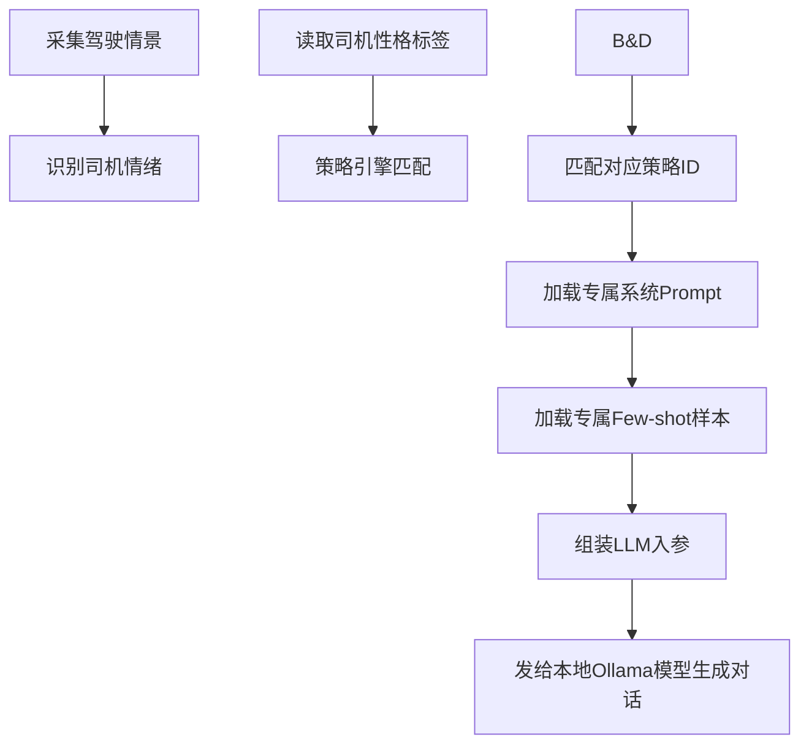
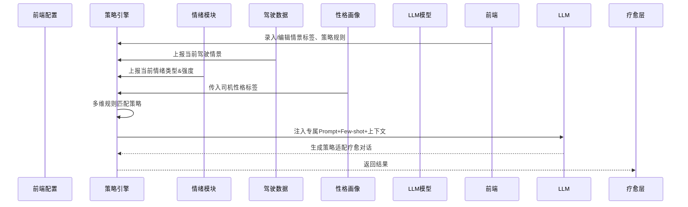

# 文档2：疗愈策略&提示词工程模块PRD

阅读状态: 未读

# 疗愈策略&Prompt工程模块 (智能座舱疗愈Agent v1.0 Demo)

**模块版本**：v1.0 Demo
**文档状态**：正式PRD
**更新日期**：2026-05-11

## 一、模块概述

疗愈策略模块是Agent心智核心，支持**前端自定义情景录入、后端策略配置、情绪-情景多分支路由**。
不同**驾驶情景 + 司机情绪**匹配独立**系统提示词（Prompt）+ Few-shot示例集**，本地大模型根据匹配策略生成定制化疗愈回复，实现分场景、分情绪、分性格的精细化疗愈心智。

## 二、核心能力

1. 支持前端录入/编辑**驾驶情景标签**（如早晚高峰、高速、拥堵、夜间长途等）
2. 按「情景 + 情绪类型」二维匹配策略规则
3. 每套策略独立配置：**专属系统Prompt + 专属Few-shot案例**
4. 策略引擎自动路由，传给LLM对应提示词与示例
5. 支持性格标签二次策略微调
6. 策略可后台配置、可前端运维编辑，无需改代码

## 三、业务流程

## 四、功能详细规则

### 4.1 情景管理（前端可配置）

| 需求点 | 详细规则 | 异常处理 |
| --- | --- | --- |
| 情景定义 | 驾驶场景维度：拥堵、高速、市区通勤、夜间长途、怠速等待、恶劣天气 | 情景识别失败：归为通用默认情景 |
| 前端编辑 | 支持运维前端新增/编辑/停用情景标签 | 配置保存失败：沿用旧配置 |
| 情景自动识别 | 基于车速、变道、时间、路况自动打标签 | 识别模糊：匹配相近情景 |
| 情景绑定 | 每个情景可绑定多条情绪策略 | 无绑定策略：走通用兜底策略 |

### 4.2 情绪-情景策略匹配

| 需求点 | 详细规则 | 异常处理 |
| --- | --- | --- |
| 匹配维度 | 二维组合：**驾驶情景 + 情绪类型**（愤怒/焦虑/烦躁/疲劳） | 无匹配策略：调用通用默认Prompt |
| 策略优先级 | 精准匹配 > 相近情景匹配 > 通用兜底 | 精准匹配失败自动降级 |
| 性格微调 | 匹配后再根据内向/外向、感性/性格微调Prompt语气 | 性格标签缺失：使用标准版本 |
| 策略启停 | 后台可启用/停用单条策略，不删除配置 | 策略停用直接跳过匹配 |

### 4.3 Prompt系统提示词管理

| 需求点 | 详细规则 | 异常处理 |
| --- | --- | --- |
| 策略独立Prompt | 每套策略拥有独立系统角色设定、疗愈定位、语气约束 | Prompt缺失：加载通用基础提示词 |
| 约束规范 | 统一约束：车载场景、不说教、温柔共情、简短口语化 | 文案违规自动过滤 |
| 变量注入 | Prompt支持注入：情绪强度、性格、场景、时间 | 变量缺失填充默认值 |
| 版本管理 | 支持Prompt版本保存、切换回滚 | 版本加载失败回退上一版 |

### 4.4 Few-shot样本工程

| 需求点 | 详细规则 | 异常处理 |
| --- | --- | --- |
| 按策略独立样本 | 每套策略配置专属少量示例对话（3-5组） | 无样本不影响推理 |
| 样本作用 | 给LLM示范当前场景疗愈话术风格、应答逻辑 | 样本格式错误自动过滤 |
| 样本规范 | 统一用户问-助手答结构，不超长 | 样本过多自动截断 |
| 动态注入 | 每次对话随Prompt一起灌入模型上下文 | 注入失败不阻塞主流程 |

### 4.5 策略引擎调度规则

| 需求点 | 详细规则 | 异常处理 |
| --- | --- | --- |
| 实时匹配 | 每次用户倾诉后实时匹配策略 | 匹配超时使用兜底策略 |
| 无感知切换 | 策略切换用户无感知，自动适配话术风格 | 切换异常保持上一套策略 |
| 缓存机制 | 同场景同情绪短时缓存策略，减少重复计算 | 缓存过期自动重匹配 |

## 五、数据结构定义（技术）

1. 情景结构体：情景ID、情景名称、识别规则、状态
2. 策略结构体：策略ID、情景ID、情绪类型、系统Prompt、Few-shot数组、性格适配标签、启用状态
3. LLM入参结构：系统Prompt + FewShot列表 + 历史上下文 + 当前用户提问 + 情绪/性格/场景标签

## 六、全局异常处理

- 情景识别失败：归入通用默认场景
- 无匹配情绪策略：加载全局通用疗愈Prompt
- Prompt配置缺失：使用系统内置基础提示词
- Few-shot格式错误：自动丢弃无效样本
- 策略匹配超时：降级通用策略
- 前端配置保存失败：沿用已有生效配置