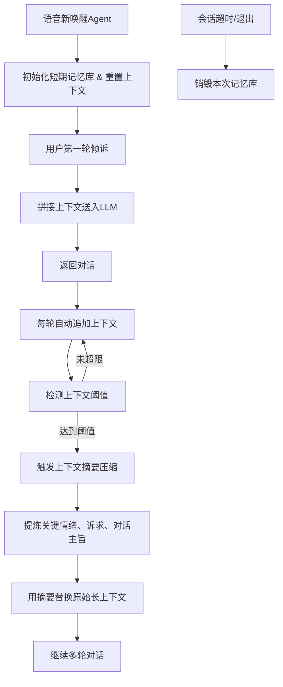

# 文档3：Agent上下文记忆&对话管理PRD

阅读状态: 未读

---

# Agent上下文记忆与对话上下文压缩模块 (智能座舱疗愈Agent v1.0 Demo)

**模块版本**：v1.0 Demo
**文档状态**：正式PRD

## 一、模块概述

本模块负责**会话生命周期管理、短期记忆库、上下文链式对话、上下文阈值检测、超长上下文自动压缩**。
实现：每次新唤醒重置记忆 → 对话实时累加上下文 → 达到阈值自动摘要压缩 → 保证长会话不超限、模型推理稳定、对话有连续记忆。

## 二、核心能力

1. 单次会话独立短期记忆，**新唤醒自动清空重置**
2. 多轮对话实时拼接上下文，维持语义连续
3. 上下文长度阈值管控（token/轮次双阈值）
4. 超长上下文自动摘要压缩、保留关键情绪与诉求
5. 压缩后替代原始上下文，继续多轮对话
6. 会话结束自动销毁记忆，不泄露隐私

## 三、业务流程



## 四、功能详细规则

### 4.1 会话与记忆生命周期

| 需求点 | 详细规则 | 异常处理 |
| --- | --- | --- |
| 会话起始 | 每次**重新语音唤醒**，强制清空历史短期记忆 | 重置失败自动重建空记忆库 |
| 会话存续 | 30s免唤醒期间持续保留上下文记忆 | 会话中断不销毁记忆 |
| 会话结束 | 语音退出 / 30s超时 → 销毁本次所有会话记忆 | 内存自动释放，不落地存储临时对话 |
| 记忆隔离 | 不同会话记忆完全隔离，互不干扰 | 记忆错乱自动重置 |

### 4.2 多轮上下文管理

| 需求点 | 详细规则 | 异常处理 |
| --- | --- | --- |
| 上下文结构 | 固定多轮格式：user:xxx / assistant:xxx | 格式错误自动补全 |
| 实时累加 | 每一轮问答自动追加到上下文队列 | 追加失败丢弃单轮记录 |
| 上下文透传 | 每次LLM请求携带完整有效上下文 | 透传失败使用单轮独立问答 |
| 语义连续 | 模型基于历史对话理解情绪变化、连续倾诉 | 上下文丢失按新会话处理 |

### 4.3 上下文阈值规则

| 需求点 | 详细规则 | 异常处理 |
| --- | --- | --- |
| 双阈值管控 | 1.对话轮次阈值（默认8轮）<br>2.Token字符阈值（默认1500） | 任一达到即触发压缩 |
| 阈值可配置 | 后端可配置轮次与字符上限，支持车企定制 | 配置异常使用默认阈值 |
| 阈值检测时机 | 每轮对话结束后检测一次 | 检测失败下一轮触发 |

### 4.4 上下文自动压缩

| 需求点 | 详细规则 | 异常处理 |
| --- | --- | --- |
| 压缩触发 | 达到轮次/Token阈值自动触发，无感知 | 压缩失败保留原上下文继续对话 |
| 压缩逻辑 | 调用LLM摘要能力：提炼用户核心情绪、发怒原因、诉求、关键对话要点 | 摘要生成失败截取前半段 |
| 替换规则 | 压缩摘要替代原始长上下文，后续基于摘要继续对话 | 摘要过短自动补充基础信息 |
| 压缩频率 | 压缩后重新计数，再次达到阈值可二次压缩 | 避免无限递归压缩 |
| 压缩隐私 | 摘要只保留情绪与诉求，不保留原话细节 | 避免敏感原话长期留存 |

### 4.5 记忆存储规则

| 需求点 | 详细规则 | 异常处理 |
| --- | --- | --- |
| 短期记忆 | 仅内存缓存，不持久化落地 | 进程回收自动清空 |
| 长期画像 | 仅沉淀情绪标签、性格标签，**不保存对话原文** | 严格隐私隔离 |
| 会话隔离 | 不同唤醒会话记忆完全隔离 | 串话自动重置记忆 |

## 五、技术设计规范

### 5.1 上下文数据结构

采用标准多轮数组：

```
[
 {"role":"user","content":"xxx"},
 {"role":"assistant","content":"xxx"}
]
```

### 5.2 压缩Prompt专用模板

内置固定摘要Prompt，仅提炼：用户核心情绪、触发原因、关键诉求、对话主题，不保留冗余闲聊。

### 5.3 接口依赖

上下文压缩复用本地Ollama模型推理，无需额外大模型。

## 六、全局异常处理

- 新唤醒重置记忆失败：自动新建空记忆会话
- 上下文追加失败：丢弃当前轮，不影响整体会话
- 达到阈值压缩失败：保留原上下文继续使用
- 摘要生成过短：自动补充场景&情绪标签
- 会话销毁异常：超时强制清空内存
- 上下文格式错乱：自动重建会话上下文

---