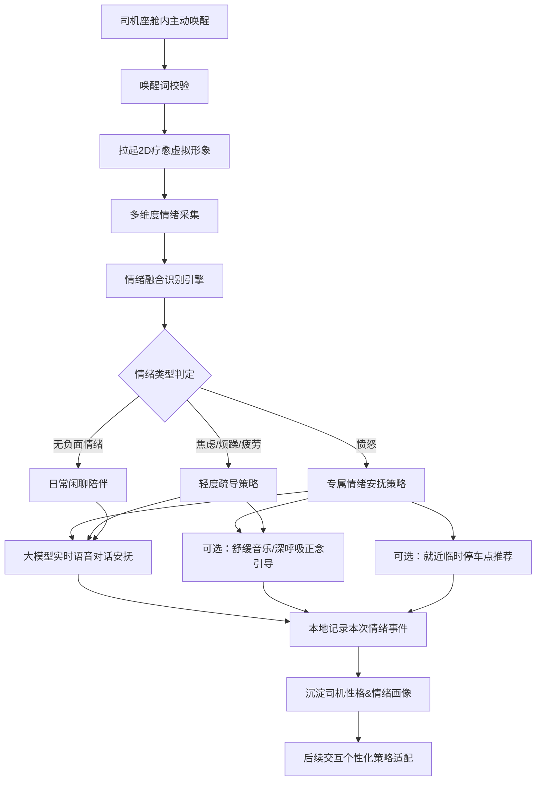
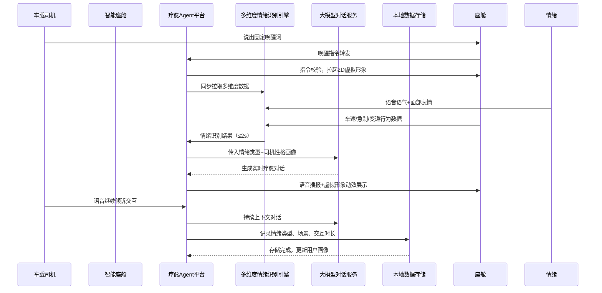

# 智能座舱疗愈Agent平台 PRD总览（v1.0 Demo版）

阅读状态: 未读

# 智能座舱疗愈Agent平台 全套PRD（v1.0 Demo版）

遵循你提供的Wanas同款PRD规范、流程图范式、表格结构、异常处理体系，基于已确认所有需求正式撰写，整体架构完整、模块拆分清晰，可直接作为产品/研发/设计落地文档。

## 全局基础信息

**产品名称**：智能座舱疗愈Agent平台
**版本**：v1.0 Demo版
**部署形态**：独立部署于智能座舱前装系统
**核心定位**：面向车载司机，通过**主动唤醒+多维度情绪识别+2D虚拟形象+大模型语音对话**，主打愤怒情绪疗愈，兼顾焦虑/烦躁/疲劳轻度疏导，提供正念引导、舒缓音乐、停车点推荐等配套疗愈能力，本地存储情绪数据用于个性化策略优化，支持车企品牌定制。
**交互规则**：全程纯语音交互、零视觉操作；情绪识别+首次回应耗时≤2s
**版本范围**：仅核心功能落地，暂不做容错兼容、多系统适配、被动触发、硬件联动

---

# 目录

1. 产品整体总览 & 业务流程
2. 唤醒入口模块
3. 多维度情绪识别模块
4. 2D虚拟形象&语音交互模块
5. 核心疗愈服务模块
6. 司机性格画像&个性化定制模块
7. 本地数据存储模块
8. 全局交互规范 & 异常处理
9. Demo版本范围 & 后续迭代规划

---

# 一、产品整体总览 & 业务流程

## 1.1 模块架构总图

## 1.2 核心时序流程

## 1.3 核心能力总览

| 能力分类 | 具体能力 | 版本范围 |
| --- | --- | --- |
| 唤醒能力 | 固定唤醒词主动唤醒 | Demo完整版 |
| 情绪识别 | 语音语气+面部表情+驾驶行为（车速/急刹/变道）+司机性格融合识别 | Demo完整版 |
| 情绪覆盖 | 主打愤怒，兼顾焦虑、烦躁、疲劳 | Demo完整版 |
| 交互形态 | 座舱屏幕2D默认虚拟形象 + 专属疗愈音色 | Demo完整版 |
| 对话能力 | 大模型实时自然语音对话，上下文连续交互 | Demo完整版 |
| 疗愈手段 | 语音安抚、舒缓音乐、深呼吸正念引导、就近停车点推荐 | Demo完整版 |
| 画像能力 | 本地沉淀司机性格、情绪触发频次/场景 | Demo完整版 |
| 定制能力 | 车企品牌、虚拟形象风格、疗愈话术定制 | Demo支持配置 |
| 交互规范 | 全程纯语音，零视觉操作，首次响应≤2s | Demo完整版 |
| 数据规则 | 仅本地存储，不上云，保护隐私 | Demo完整版 |

---

# 二、唤醒入口模块

## 2.1 需求说明

固定唤醒词**主动触发**，无被动唤醒、无自定义唤醒词；唤醒后立即拉起2D虚拟形象，进入疗愈交互状态。

## 2.2 原型与规则

| 需求点 | 原型描述 | 详细规则 | 异常处理 |
| --- | --- | --- | --- |
| 固定唤醒词 | 座舱内全程待命，监听固定唤醒口令 | Demo版采用系统固定唤醒词，不支持用户自定义、不支持多唤醒词 | 唤醒词识别失败：无任何弹窗/语音提示，静默不响应 |
| 唤醒触发条件 | 车辆行驶/怠速/驻车全场景均可唤醒 | 不限制车速、行驶状态，任何驾驶场景均可主动唤醒 | 座舱音频通道占用（通话/导航）：唤醒无效，静默拦截 |
| 唤醒后表现 | 座舱屏幕弹出默认2D疗愈虚拟形象 | 形象居中展示，不遮挡导航、驾驶核心信息；伴随轻微待机动效 | 屏幕渲染失败：仅语音进入交互，不展示虚拟形象 |
| 待命状态 | 未唤醒时后台静默监听，无界面展示 | 不占用前台视觉资源，低功耗运行 | 系统资源不足：自动降低监听频次，不影响座舱主功能 |

## 2.3 交互逻辑

司机说出固定唤醒词 → 座舱音频采集 → Agent校验匹配 → 拉起2D虚拟形象 → 进入语音倾听状态，等待司机情绪倾诉。

---

# 三、多维度情绪识别模块

## 3.1 需求说明

融合**4大类数据**做情绪识别：语音语义&语气、面部表情、驾驶行为、司机性格画像；仅主动唤醒后触发识别，全程≤2s出结果。

## 3.2 数据采集维度

| 数据类型 | 采集内容 | 识别作用 |
| --- | --- | --- |
| 语音维度 | 倾诉文本语义、说话语速、语气高低、情绪语调 | 判断愤怒/焦虑/烦躁主观情绪 |
| 面部维度 | 司机面部微表情、眉头、嘴角状态 | 辅助校验负面情绪强度 |
| 驾驶行为 | 当前车速、急刹次数、频繁变道、急转弯频次 | 判定驾驶压力、易怒诱因 |
| 性格画像 | 本地已沉淀司机内向/外向、感性/理性 | 适配个性化疗愈话术风格 |

## 3.3 识别规则

| 需求点 | 详细规则 | 异常处理 |
| --- | --- | --- |
| 识别时效 | 从司机停止倾诉到输出情绪结果，整体≤2s | 超时未出结果：默认按普通闲聊模式回应 |
| 情绪分级 | 愤怒（核心）> 焦虑/烦躁/疲劳（轻度）> 无负面情绪 | 识别模糊：降级按轻度焦虑疏导 |
| 数据融合逻辑 | 多维度加权打分，综合判定情绪类型 | 某类数据缺失（如无面部摄像头）：自动降级，仅用语音+驾驶行为识别 |
| 触发时机 | 仅主动唤醒后首次倾诉触发识别，后续对话沿用上下文情绪 | 中途情绪变化：不二次主动识别，依赖大模型上下文理解 |
| 场景标签 | 自动记录情绪触发场景：拥堵/高速/市区/怠速 | 场景标签缺失：标记为通用场景 |

## 3.4 限制规则

Demo版**暂不做误判容错**，识别错误不提供手动纠正入口，静默按识别结果执行疗愈。

---

# 四、2D虚拟形象&语音交互模块

## 4.1 需求说明

Demo仅**1套默认2D虚拟形象**，搭配专属疗愈音色；全程纯语音交互，形象跟随对话做基础动效。

## 4.2 2D虚拟形象规则

| 需求点 | 原型描述 | 详细规则 | 异常处理 |
| --- | --- | --- | --- |
| 形象展示 | 座舱屏幕居中2D静态+基础动效 | 默认治愈系人设，Demo仅唯一版本，无切换入口 | 资源加载失败：黑屏占位，仅保留语音交互 |
| 动效逻辑 | 倾听、回应、疗愈三种基础姿态 | 司机说话=倾听动效；Agent回应=说话动效 | 动效渲染异常：固定待机姿态不影响交互 |
| 展示层级 | 悬浮层展示，不遮挡导航、车速仪表盘 | 适配座舱默认屏幕分辨率 | 分辨率适配异常：居中缩放展示 |
| 退出规则 | 语音说“退出疗愈”/长时间无交互自动收起 | 无手动点击关闭，仅语音指令+超时自动关闭 | 退出指令识别失败：30s无交互自动收起 |

## 4.3 语音交互规则

| 需求点 | 详细规则 | 异常处理 |
| --- | --- | --- |
| 音色设定 | 固定温柔治愈系女声，Demo不可切换 | 语音播放异常：静默文字不展示，保持对话逻辑 |
| 交互方式 | 全程免唤醒连续对话，无需重复喊口令 | 连续倾听中断：重新说出唤醒词即可再次进入 |
| 大模型能力 | 实时生成自然对话，理解情绪、共情安抚 | 大模型响应超时：触发预设兜底安抚话术 |
| 语音降噪 | 适配座舱行驶噪音、空调噪音，自动降噪 | 噪音过大识别不清：语音提示“没听清，请再说一遍” |

---

# 五、核心疗愈服务模块

## 5.1 能力总览

包含5项疗愈能力：**大模型共情对话、舒缓音乐播放、深呼吸正念引导、就近停车点推荐、日常陪伴闲聊**

## 5.2 分项规则

### 5.2.1 情绪对话安抚

- 愤怒：共情理解+情绪疏导+理性劝解，话术沉稳温柔
- 焦虑/烦躁/疲劳：轻度解压、放松闲聊、情绪舒缓
- 无负面情绪：日常陪伴闲聊，不强行疗愈

### 5.2.2 舒缓音乐

| 需求点 | 规则 | 异常处理 |
| --- | --- | --- |
| 触发方式 | 语音指令“放首舒缓音乐”即可播放 | 音乐资源缺失：语音提示“暂时无法播放” |
| 播放逻辑 | 接管座舱音频，音量自适应降低不影响导航 | 音频通道冲突：优先导航，暂停音乐 |
| 曲目库 | Demo内置固定治愈轻音乐列表，无搜索切换 | 播放失败：自动换下一首 |

### 5.2.3 深呼吸正念引导

- 语音口令触发：“帮我做放松引导”
- 标准口令式引导：吸气4s→屏息4s→呼气6s，全程语音带领
- 适配驾驶场景，引导简单易操作，不分心驾驶

### 5.2.4 临时停车点推荐

| 需求点 | 规则 | 异常处理 |
| --- | --- | --- |
| 触发条件 | 司机情绪愤怒值较高时，主动语音推荐 | 无道路数据：语音提示“暂无附近停车点推荐” |
| 推荐逻辑 | 基于座舱地图，推荐当前就近安全临时停车区 | 地图接口异常：不强行推荐 |
| 展示方式 | 仅语音播报地点，不弹窗导航跳转 |  |

### 5.2.5 超时退出规则

- 连续30s无语音交互，自动结束对话、收起虚拟形象
- 可随时语音指令「退出疗愈」手动关闭

## 5.3 疗愈策略匹配

系统根据**情绪类型+司机性格+驾驶场景**自动匹配对应疗愈话术和服务组合。

---

# 六、司机性格画像&个性化定制模块

## 6.1 司机性格画像

| 需求点 | 详细规则 | 异常处理 |
| --- | --- | --- |
| 画像维度 | 内向/外向、感性/理性、易怒程度 | 基于历史语音、情绪触发记录本地自动生成 |
| 更新时机 | 每次疗愈交互后静默更新 | 数据异常：保留原有画像不影响使用 |
| 作用范围 | 仅用于适配大模型话术风格，不上云 | 画像生成失败：使用通用疗愈话术 |

## 6.2 车企个性化定制（Demo可配置）

| 定制项 | 定制范围 |
| --- | --- |
| 品牌定制 | 开场话术、品牌专属问候语 |
| 虚拟形象 | 后续可替换2D形象人设（Demo固定1套） |
| 疗愈话术 | 定制专属安抚风格、方言音色（后续扩展） |
| 超时时间 | 可配置无交互自动收起时长 |

---

# 七、本地数据存储模块

## 7.1 存储规则

- 所有情绪记录、交互日志、司机画像**仅本地存储，不上云端**
- 不采集隐私敏感信息，仅存储情绪类型、触发场景、交互时长、性格标签
- 数据生命周期：永久本地保留，支持语音指令“清除我的情绪记录”一键清空

## 7.2 存储字段

情绪类型、触发时间、驾驶场景、交互时长、情绪强度、性格画像标签

## 7.3 数据用途

仅用于**本地疗愈策略优化**，让后续对话更贴合司机性格和情绪习惯，无数据分析上报。

## 7.4 异常处理

本地存储异常：不弹窗、不影响实时交互，下次正常写入即可。

---

# 八、全局交互规范 & 异常处理

## 8.1 全局交互规范

1. 全程**纯语音交互**，无任何点击、触控操作
2. 情绪识别+首次回应严格≤2秒
3. 2D形象悬浮不遮挡座舱核心行车信息
4. 所有功能仅语音指令触发，无界面操作入口
5. 后台低功耗运行，不占用座舱主资源

## 8.2 全局异常处理（汇总）

- 唤醒词识别失败：静默无响应
- 音频通道被占用（导航/通话）：拦截唤醒
- 情绪识别超时：默认闲聊兜底回应
- 大模型响应超时：触发预设安抚话术
- 虚拟形象资源加载失败：仅保留语音交互
- 音乐播放失败：自动切歌或语音提示
- 本地存储异常：不影响实时交互
- 地图无停车点数据：语音友好提示
- 连续语音倾听中断：重新唤醒即可恢复

---

# 九、Demo版本范围 & 后续迭代规划

## 9.1 Demo版已包含

1. 固定唤醒词主动唤醒
2. 多维度融合情绪识别（语音+表情+驾驶行为+性格）
3. 单套2D虚拟形象+专属疗愈音色
4. 大模型实时共情对话疗愈
5. 舒缓音乐/正念引导/停车点推荐
6. 本地情绪&画像存储，不上云
7. 全程纯语音、≤2s响应
8. 车企基础个性化配置

## 9.2 本期暂不做

1. 无被动情绪监测自动唤醒
2. 无情绪识别手动纠错容错
3. 不兼容多座舱系统、多终端适配
4. 无座舱灯光/香氛硬件联动
5. 无多虚拟形象、多音色切换
6. 无云端数据同步、账号登录
7. 无情绪数据报表、可视化面板

## 9.3 后续可迭代方向

1. 新增多套2D形象、多音色选择
2. 支持自定义唤醒词
3. 新增被动情绪自动识别介入
4. 联动座舱灯光、香氛、氛围音效
5. 增加情绪数据可视化面板
6. 支持方言疗愈对话
7. 云端多设备画像同步
8. 新增路怒干预、长途疲劳专项疗愈

---

我可以接下来帮你：

1. 把这份PRD拆成**产品需求文档精简版**给研发排期
2. 单独出**交互流程图、原型说明**
3. 按模块输出后端/前端/算法分拆需求
